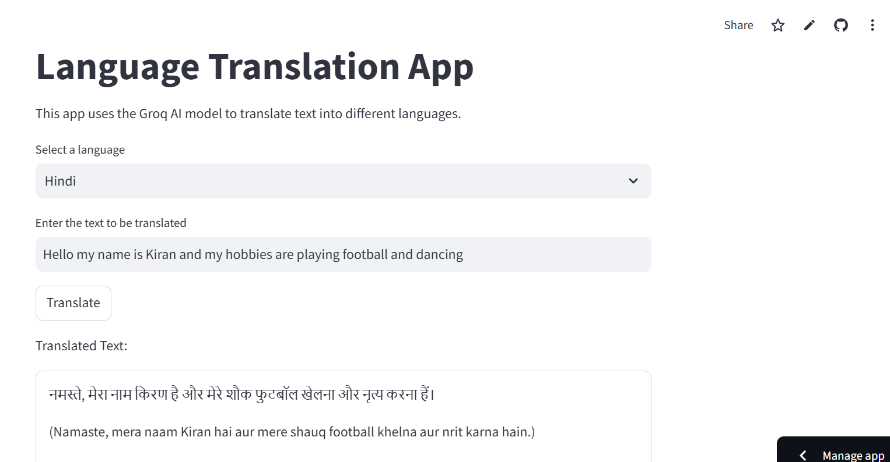

# Language Translation App using Groq

## Project Overview

This project is a language translation application leveraging the Groq AI model. The app provides a simple and intuitive interface for translating text into multiple languages, including Hindi, French, and Spanish. It integrates Groq's advanced language model to ensure accurate and context-aware translations.

## Project Structure

```
├── app.py               # Main application file
├── requirements.txt     # Dependencies for the project
├── .env                 # Environment variables (not included in the repository)
```


## Key Technologies

- **Groq AI**: Utilized for the underlying language translation model.
- **LangChain**: For managing prompts and integrating the language model.
- **Streamlit**: For creating the interactive user interface.

## Features

- Multi-language support: Translate text into Hindi, French, or Spanish.
- User-friendly interface powered by Streamlit.
- Real-time feedback and error handling.
- Uses the "Gemma2-9b-It" model from Groq for high-quality translations.

## Installation

### Steps

1. Clone the repository:

   ```cmd
   git clone https://github.com/kiran-91/A-simple-language-translation-app.git
   cd A-simple-language-translation-app
   ```

2. Install the required Python packages:

   ```bash 
   pip install -r requirements.txt
   ```

3. Create a `.env` file to securely store your API keys:

   ```bash
   GROQ_API_KEY=<your_groq_api_key>
   ```

4. Run the Streamlit application:

   ```cmd
   streamlit run app.py
   ```

## Results
If you're on Team Lazy like me and would rather skip all the tasks, no worries—just kick back and check out the Streamlit app right here!
```bash
https://language-translation.streamlit.app 
```

## Usage

1. Select the target language from the dropdown menu.
2. Enter the text you want to translate.
3. Click the "Translate" button to get the translated text.
4. If no text is entered, an error message will prompt you to enter valid input.




## Acknowledgments

- [Groq AI](https://www.groq.com/): For their powerful and efficient language model.
- [Streamlit](https://streamlit.io/): For the elegant and user-friendly UI framework.

